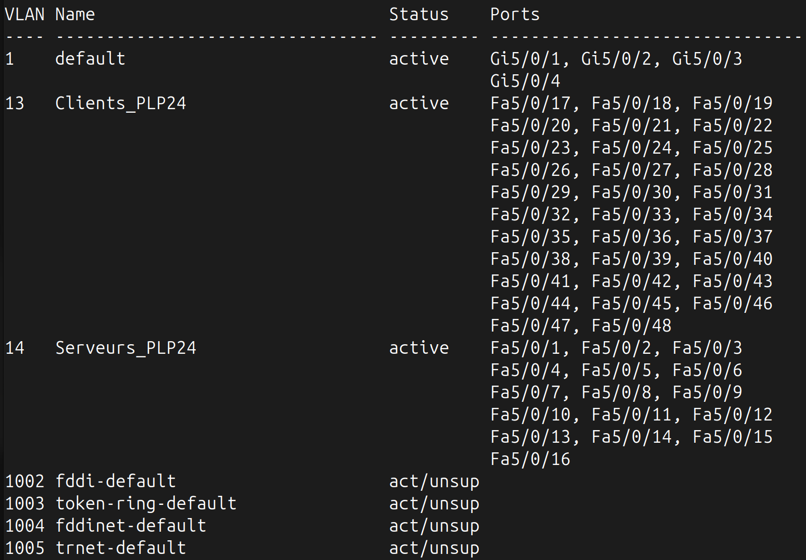
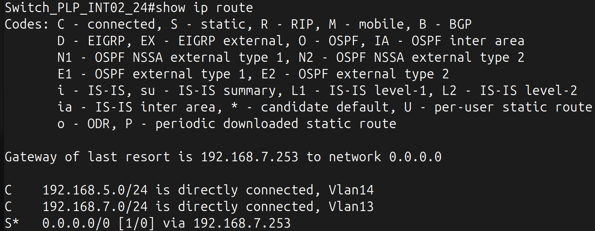
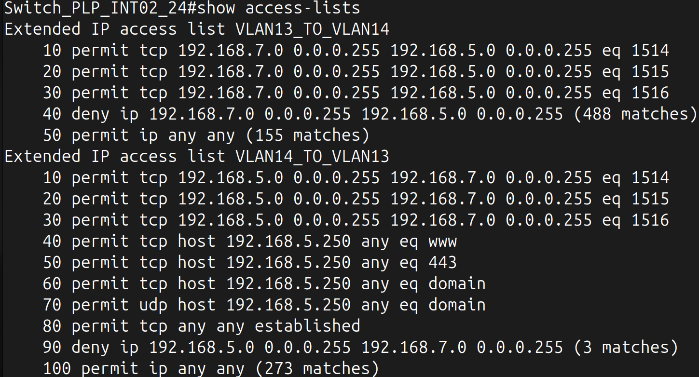
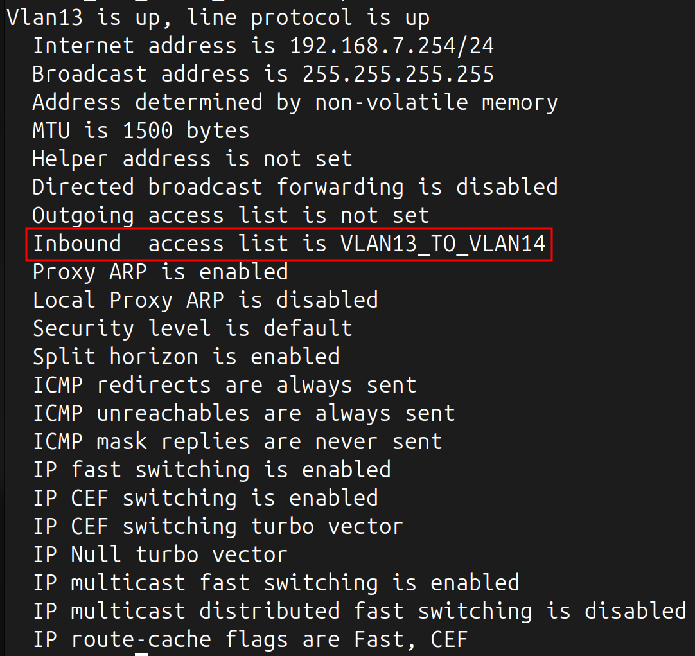
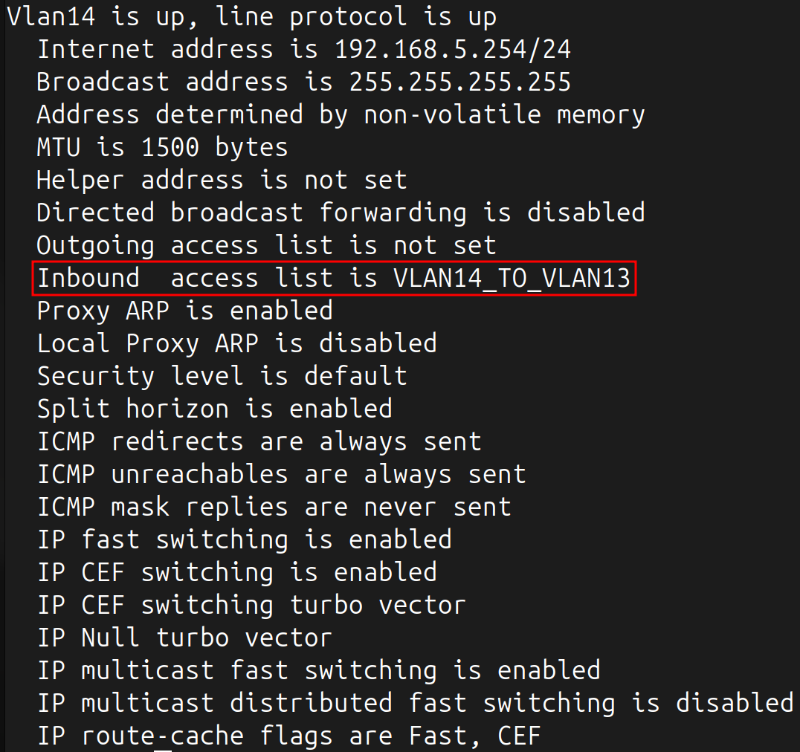

Pour interconnecter nos machines, nous disposons d'un Switch Cisco 3750 de 48 ports FastEthernet et 4 port GigabitEthernet.

Pour se connecter au switch depuis le firewall (un câble console y est connecté), on peut utiliser la commande suivante depuis la console du firewall :
```bash
cu -l /dev/cuau0 -s 9600
```

Nous nous retrouvons ainsi sur la console du switch.

Nous renommons le switch pour le différencier des autres :
```bash
en
conf t
hostname Switch_PLP_INT02_24
```

Nous configurons ensuite les VLANs que nous allons utiliser :
```bash
en
conf t
vlan 13
name Clients_PLP24
exit
vlan 14
name Serveurs_PLP24
exit
```

Nous configurons ensuite les ports du switch dans les 2 VLANs.
Les ports **1 à 16** serviront pour le **VLAN 14 Serveurs**, et les ports **17 à 48** au **VLAN 13 Clients** :
```bash
en
conf t
interface range FastEthernet 1/0/1-1/0/16
switchport mode access
switchport access vlan 14
exit
interface range FastEthernet 1/0/17-1/0/48
switchport mode access
switchport access vlan 13
exit
```

On peut observer la liste des ports attribués à chaque VLAN avec la commande suivante :
```bash
en
show vlan brief
```


Puisque ce switch peut fonctionner en niveau 3 et que l'on souhaite qu'il soit responsable du routage inter-vlan, on utilise la commande suivante pour activer le niveau 3 :
```bash
en
conf t
ip routing
exit
```

On configure ensuite les interfaces VLAN (SVI) pour qu'elles agissent comme des passerelles pour chacune des VLANs :
```bash
en
conf t
interface vlan13
interface Vlan13
ip address 192.168.7.254 255.255.255.0
no shutdown
exit
interface Vlan14
ip address 192.168.5.254 255.255.255.0
no shutdown
exit
```

On peut vérifier que les routes sont bien créées avec la commande suivante :
```bash
en
show ip route
```



Désormais, chaque machines dans l'un des 2 VLANs devra se voir attribuer comme passerelle l'adresse de l'interface du VLAN correspondant

Evidemment, nous souhaitons que les machines du VLAN 13 Clients puissent accéder à Internet.

Pour cela, nous ajoutons une route par défaut sur le switch pour rediriger les flux vers l'adresse LAN de l'OPNSense :
```bash
en
conf t
ip route 0.0.0.0 0.0.0.0 192.168.7.253
```

Nous allons créer des ACLs au sein du switch afin de laisser passer les flux suivants :
- Prise en compte que seule la machine Cortex située dans le VLAN 14 Serveurs peut communiquer avec Internet,
- Couper tout trafic entre le VLAN 13 Clients et le VLAN 14 Serveurs A L'EXCEPTION du port 1514, 1515 et 1516 nécessaires à la communication des agents Wazuh des machines situées dans le VLAN 13 Clients vers le serveur situé dans le VLAN 14 Serveurs.

Pour cela, on exécute les commandes suivantes :
```bash
en
conf t
ip access-list extended VLAN13_TO_VLAN14
permit tcp 192.168.7.0 0.0.0.255 192.168.5.0 0.0.0.255 eq 1514
permit tcp 192.168.7.0 0.0.0.255 192.168.5.0 0.0.0.255 eq 1515
permit tcp 192.168.7.0 0.0.0.255 192.168.5.0 0.0.0.255 eq 1516
deny ip 192.168.7.0 0.0.0.255 192.168.5.0 0.0.0.255
permit ip any any
```

Détail de cette ACL :
- Lignes 1-3 : Autorisent les communications TCP depuis les machines du VLAN 13 (192.168.7.0/24) vers les machines du VLAN 14 (192.168.5.0/24) sur les ports 1514, 1515 et 1516. Ces ports sont utilisés par Wazuh pour la communication entre les agents et le serveur.
- Ligne 4 : Bloque tout autre trafic entre VLAN 13 et VLAN 14.
- Ligne 5 : Permet à tout autre trafic de circuler librement vers l'extérieur (Internet, autres VLANs, etc.). On utilise cette règle pour l'accès à Internet notamment, et puisqu'il n'existe pas d'autre VLAN sur le switch on peut la laisser comme cela.

On l'attribue au VLAN 13 Clients :
```bash
en
conf t
interface vlan 13
ip access-group VLAN13_TO_VLAN14 in
exit
```
On crée une autre ACL avec les commandes suivantes :
```bash
en
conf t
ip access-list extended VLAN14_TO_VLAN13
permit tcp 192.168.5.0 0.0.0.255 192.168.7.0 0.0.0.255 eq 1514
permit tcp 192.168.5.0 0.0.0.255 192.168.7.0 0.0.0.255 eq 1515
permit tcp 192.168.5.0 0.0.0.255 192.168.7.0 0.0.0.255 eq 1516
permit tcp host 192.168.5.250 any eq 80
permit tcp host 192.168.5.250 any eq 443
permit tcp host 192.168.5.250 any eq 53
permit udp host 192.168.5.250 any eq 53
permit tcp any any established
deny ip 192.168.5.0 0.0.0.255 192.168.7.0 0.0.0.255
permit ip any any
exit
```

Détail de cette ACL :
- Lignes 1-3 : Autorisent les réponses des communications Wazuh vers les machines VLAN 13.
- Ligne 4-5 : Autorisent la machine 192.168.5.250 (Cortex) à effectuer des requêtes HTTP (80) et HTTPS (443).
- Lignes 6-7 : Autorisent Cortex à résoudre des noms de domaines (TCP et UDP sur le port 53).
- Ligne 8 : Autorise les connexions déjà établies (established permet de laisser passer les réponses aux requêtes initiées depuis VLAN 14).
- Ligne 9 : Bloque tout autre trafic entre VLAN 14 et VLAN 13.
- Ligne 10 : Permet tout autre trafic vers l'extérieur.

Attention ici, il se peut que les autres machines du VLAN 14 puissent avoir accès à Internet.
Pour s'assurer que ce n'est pas le cas, nous configurerons une règle dans le firewall OPNSense pour n'autoriser les flux que de la machine Cortex.

On l'attribue au VLAN 14 Serveurs :
```bash
en
conf t
interface vlan 14
ip access-group VLAN14_TO_VLAN13 in
exit
```

On peut finalement vérifier la liste des ACLs avec la commande suivante :
```bash
en
show access-lists
```



Et on peut également vérifier que les interfaces utilisent bien les ACLs :
```bash
en
show ip interface vlan 13 #(ou 14)
```



