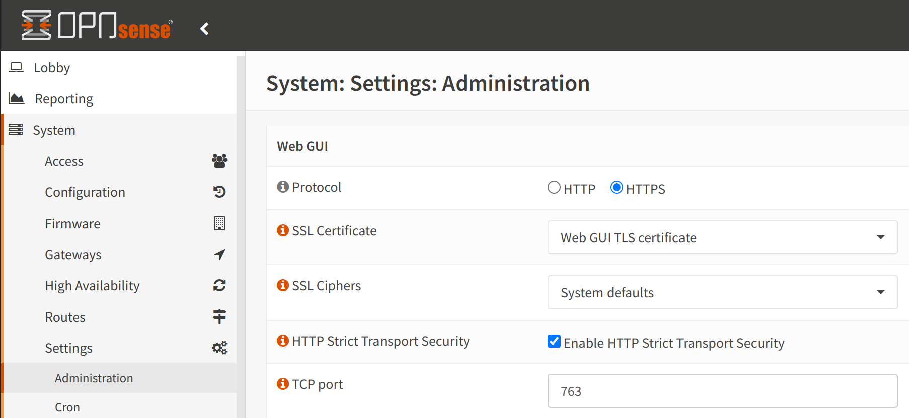
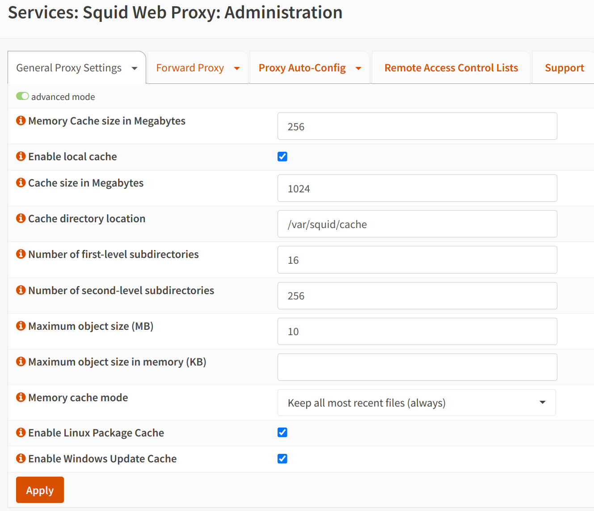
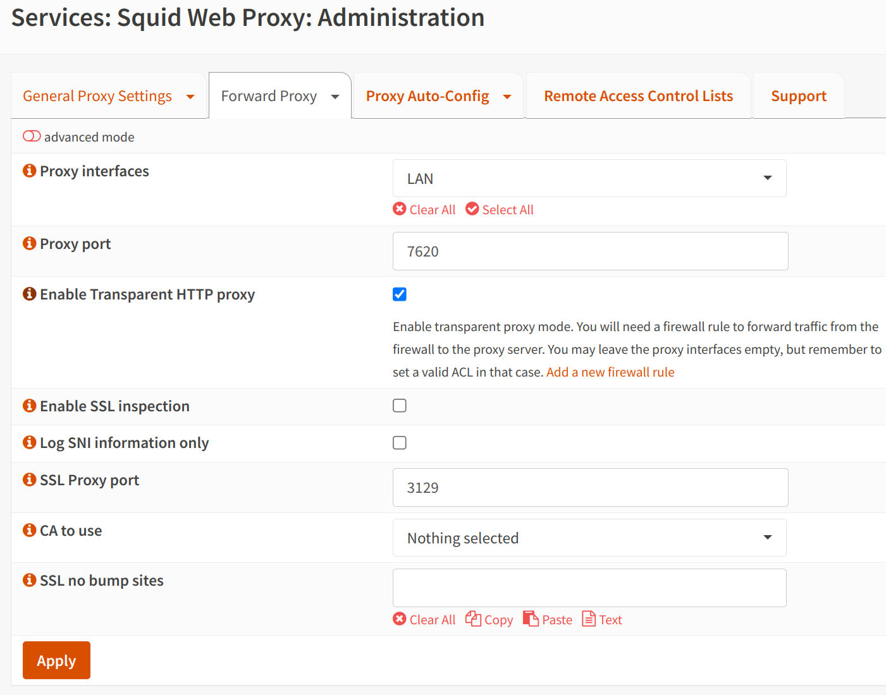
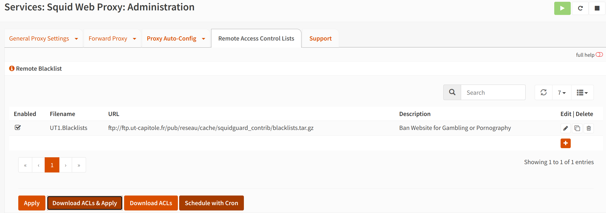

<link rel="stylesheet" type="text/css" href="style.css">

Ce document est relatif à l'installation d'OPNsense 25.1 et d'outils supplémentaires sur un rack de serveur HP Proliant DL380G5 contenant 8Go de RAM DDR2, un Intel Xeon 5150 @ 2.66GHz à 4 coeurs et 2 interfaces réseau pour les réseaux WAN et LAN.

- [Installation de l'OS OPNsense](#installation-de-los-opnsense)
- [Configuration des interfaces réseau](#configuration-des-interfaces-réseau)
- [Accès à l'interface de gestion web](#accès-à-linterface-de-gestion-web)
- [Assistant de configuration](#assistant-de-configuration)
- [Sécurisation supplémentaire de l'interface web](#sécurisation-supplémentaire-de-linterface-web)
- [Accès SSH sécurisé à la console root d'OPNsense](#accès-ssh-sécurisé-à-la-console-root-dopnsense)
- [Mise en place de règles NAT pour la connexion à Internet des machines dans le VLAN 13 Clients et la machine Cortex.](#mise-en-place-de-règles-nat-pour-la-connexion-à-internet-des-machines-dans-le-vlan-13-clients-et-la-machine-cortex)
- [Mise en place de règles de pare-feu](#mise-en-place-de-règles-de-pare-feu)
- [Mise en place du proxy Squid pour la journalisation des communications HTTP](#mise-en-place-du-proxy-squid-pour-la-journalisation-des-communications-http)
- [Mise en place d'un blocage d'IPs malveillantes](#mise-en-place-dun-blocage-dips-malveillantes)
- [Configuration de l'IDS/IPS Suricata](#configuration-de-lidsips-suricata)
- [Installation de l'agent Wazuh pour récupérer les logs d'OPNSense et des outils dans le SIEM](#installation-de-lagent-wazuh-pour-récupérer-les-logs-dopnsense-et-des-outils-dans-le-siem)
- [Sources :](#sources-)


## Installation de l'OS OPNsense

Pour l'installation, nous avons suivi les étapes suivantes :
- Téléchargement de l'image ISO d'OPNsense 24.7.10 sur le site officiel au format dvd-amd64.
- Création d'une clé USB bootable à partir de l'image ISO téléchargée.
- Installation d'OPNsense sur le serveur dédié.
- (Optionnel) Mise à jour de l'OS vers la version 25.1.

Lors du premier démarrage de l'image, le système va être accessible en "live" dans la mémoire du serveur.

Il faut alors utiliser le compte **installer** avec le mot de passe **opnsense** pour accéder à l'interface d'installation.

Après avoir choisi le langage du clavier, nous avons opté pour une installation au format **ZFS**. Ce format possède plusieurs avantages face à **UFS** :
- Il permet une meilleure gestion des snapshots pour faire des sauvegarde et des restaurations.
- Il permet de garder plusieurs copies des métadonnées pour éviter les corruptions de données.
- Il offre une meilleure robustesse des données.

Par la suite, nous n'avons opté pour aucun système de redondance des disques pour des raisons de simplicité.

Une fois l'installation, nous avons modifié le mot de passe de l'utilisateur **root** et avons laissé le serveur redémarrer.

## Configuration des interfaces réseau

Une fois le serveur redémarré, nous nous sommes connecté avec le compte **root** et nous avons configuré les interfaces réseau WAN et LAN.

Pour cela, nous pouvons utiliser l'interface web d'OPNsense en accédant à l'adresse IP de l'interface LAN indiqué sur la console, ou nous pouvons utiliser directement la console avec l'option 1.

Dans notre cas, suite à des problèmes de liaisons avec les serveurs de production devant nous assurer un accès à Internet, nous nous sommes rabattus sur la configuration suivante :
- Interface WAN reliée à un téléphone par câble USB pour avoir une connexion Internet.
- Interface LAN reliée à un switch pour avoir un accès au réseau local

(<span style="font-size: 3em;">**/!\\**</span> Dans notre cas, c'est l'interface 2 du firewall qui gérera la communication du LAN).

La configuration se fait comme suit :
- Utilisation de l'option 1 sur la console.
- Nous refusons la configuration des LAGGs et des VLANs pour des raisons de simplicité.
- Nous sélectionnons l'interface WAN et LAN parmis les interfaces disponibles.
- Nous validons nos choix.

Si la configuration est correcte, la console affichera une adresse IP pour l'interface LAN et l'interface WAN.

## Accès à l'interface de gestion web

Il est conseillé d'accèder à cette interface depuis l'interface LAN.
Cependant, s'l est nécessaire d'accéder à l'interface de gestion depuis l'interface WAN, il est possible de le faire en utilisant l'option 8 sur la console et en rentrant la commande suivante qui désactive la fonction firewall d'OPNSense, réduisant ainsi de manière extrême la sécurité du réseau :
```shell
pfctl -d
```

<span style="font-size: 3em;">**/!\\**</span> Veillez à bien réactiver la fonction firewall en exécutant la commande suivante si vous avez utilisé la commande précédente :
```shell
pfctl -e
```

Nous pouvons désormais accéder à l'interface de gestion web d'OPNsense.

## Assistant de configuration

Lors de la première connexion, un assistant de configuration nous guide pour la configuration de base de notre pare-feu:


Nous avons modifié le nom de domaine local en **insoc.local** afin de distinguer notre réseau local des autres réseaux et avons modifié les serveurs DNS pour utiliser ceux de Cloudflare (à savoir 1.1.1.1 et 1.0.0.1).

Finalement, nous avons laissé l'option **Enable Resolver** activée pour utiliser notre firewall en tant que résolveur DNS.

L'étape suivante laisse la possibilité de définir un serveur NTP pour la synchronisation de l'heure. Nous avons laissé l'option par défaut car nous n'avons pas de serveur NTP à disposition.

L'étape suivante permet de configurer l'interface WAN. Nous avons choisi l'option DHCP pour obtenir une adresse IP automatiquement de la part du serveur DHCP de notre FAI (ici, notre téléphone).

Sur la même page, nous avons décoché l'option **Block RFC1918 Private Network** pour autoriser le trafic des adresses IP réservées aux réseaux privés. En effet, dans le cas de notre LAB, nous n'utilisons pas d'adresses IP publiques. Nous nous serions alors retrouvé sans accès à Internet si l'option était restée cochée.


La page suivante permet de configurer l'interface LAN. Afin de s'assurer que notre réseau possède des adresses IP facilement identifiables, nous avons changé l'adresse IP de cette interface en `192.168.7.254/24`. Ainsi, chaque machine dans notre réseau LAN aura une adresse IP de la forme `192.168.7.X` attribuée par le serveur DHCP d'OPNsense.

La page suivante permet de modifier le mot de passe de l'utilisateur **root**. Puisqu'il est déjà configuré, nous pouvons directement passer à la suite.

La configuration initiale est désormais terminée !

Afin de s'assurer que les adresses IP attribuées par le serveur DHCP d'OPNsense sont bien celles que nous avons définies, nous pouvons nous rendre dans la section **Services > ISC DHCPv4 > [LAN]** :


Il y est même possible de définir la plage d'adresses IP attribuées.

## Sécurisation supplémentaire de l'interface web

Afin de sécuriser d'avantage l'accès à l'interface web, nous avons modifié le port d'accès par défaut (443) pour un port différent (763) en allant dans **System > Settings > Administration** :



## Accès SSH sécurisé à la console root d'OPNsense

Pour des questions d'accès simplifié à la console OPNsense, il est possible d'activer l'accès SSH en allant dans **System > Settings > Administration** et en cochant l'option **Enable Secure Shell**.

Afin de sécuriser au mieux cette connexion, nous avons modifié le port SSH par défaut (22) pour un port différent (762).

Dans la grosse majorité des cas, il est fortement déconseillé de se connecter en SSH avec le compte root. C'est pourquoi nous allons créer un utilisateur pour l'accès SSH root.

Il est nécessaire de cocher l'option **Permit root user login** pour autoriser la connexion en tant que root le temps de configurer un utilisateur pour l'accès SSH.

Afin d'éviter de devoir renseigner nous même les clés SSH pour l'utilisateur créé, nous allons autoriser les connexions SSH par mot de passe en cochant l'option **Permit password login**.


Par la suite, nous créons l'utilisateur en allant dans **System > Access > Users** et en cliquant sur **Add**.

Nous lui renseignons un nom d'utilisateur, un mot de passe et lui attribuons le rôle **admins** dans la section **Group Memberships** avec un accès à **/bin/sh** configuré dans la section **Login shell**.

Nous nous connectons par la suite en SSH avec le compte root pour ajouter le nouvel utilisateur au groupe **wheel** en utilisant la commande suivante :
```bash
pw groupmod wheel -m <nom_utilisateur>
```

Une fois cela fait, nous modifions le fichier sudoers pour autoriser l'utilisateur à utiliser uniquement la commande sudo en utilisant la commande suivante :
```bash
visudo
```
et nous renseignons les lignes suivantes à la fin du fichier :
```bash
<nom_utilisateur> ALL=(ALL) /usr/bin/su, /usr/bin/sh

Defaults rootpw
```
Ces lignes permettent d'autoriser l'utilisateur à n'utiliser que les commandes `su` et `sh` avec la commande sudo, et de demander le mot de passe root pour les commandes sudo.

Finalement, nous désactivons l'accès en tant que root en SSH en décochant l'option **Permit root user login**.

Désormais, pour nous connecter en SSH et effectuer des modifications dans les fichiers, il faudra passer par le compte intermédiaire créé précédemment et utiliser la commande `su` pour passer en root en renseignant le mot de passe root.

## Mise en place de règles NAT pour la connexion à Internet des machines dans le VLAN 13 Clients et la machine Cortex.
Pour permettre aux machines des 2 VLANs de communiquer avec Internet, il est nécessaire d'appliquer des règles NAT à notre infrastructure.


Sur l'image précédente, on observe que nous utilisons le mode **Hybrid**. Cela nous permet de créer des règles manuellement tout en laissant OPNSense générer automatiquement certaines d'entre elles.

Dans les règles que nous avons créé, nous pouvons voir que les 2 réseaux situés dans des VLANs différents sont renseignées afin de laisser la possibilité aux machines des 2 réseaux d'utiliser l'adresse IP publique du firewall pour accèder à Internet.

## Mise en place de règles de pare-feu

Afin de sécuriser notre réseau, nous avons mis en place des règles de pare-feu pour autoriser ou bloquer le trafic entrant et sortant.

Ces règles sont les suivantes et permettent uniquement le trafic HTTPS, DNS et les pings provenant de l'interface LAN :


Les 2 premières règles permettent le trafic DNS depuis nos machines locales vers les serveurs DNS de Cloudflare uniquement.

La 3è règle est une règle spéciale créée par OPNSense après la configuration du proxy Squid que nous évoquerons par la suite.

Les 4è et 5è règles permettent le trafic HTTPS depuis nos machines locales vers les serveurs HTTPS ainsi que les réponses de ces serveurs.

La 6è règle permet les pings depuis nos machines locales vers le serveur OPNsense (notamment pour s'assurer que l'on peut communiquer avec lui. Il est possible de bloquer les pings en désactivant la règle).

la 7è règle permet d'autoriser la machine Cortex à communiquer avec Internet, notamment pour effectuer des requêtes API vers AbuseIPDB et VirusTotal. (Ici, la règle laisse passer tout le trafic. Par manque de temps, nous n'avons pas pu traiter cette partie spécifique pour la sécuriser d'avantage.)
A noter que cette règle nous permet d'avantage de sécuriser la connexion Internet de notre VLAN 14 Serveurs à la seule machine qu'est Cortex.

La dernière règle permet de bloquer tout le reste du trafic.

## Mise en place du proxy Squid pour la journalisation des communications HTTP

Notre table de filtrage ne contient aucune règles concernant l'HTTP. Ceci s'explique par le fait que nous utilisons un proxy Squid nous permettant de filtrer ce trafic. Il permet également de bloquer des sites web indésirables par le biais d'ACLs et nous permet de loguer les accès des machines à ces sites.

Pour installer ce proxy, il suffit d'aller dans **System > Firmware > Plugins** et de chercher le plugin **os-squid**.

Une fois installé, il est possible de le configurer en allant dans **Services > Squid Web Proxy**.

Nous avons configuré les paramètres généraux de notre proxy de la manière suivante :


Cette partie permet simplement d'activer le proxy, de définir quelles seront les formats des pages d'erreurs et d'activer ou non la collecte de log pour le proxy.

Dans la section **General Proxy Settings > Local Cache Settings**, nous avons appliqué les paramètres suivants :



Cette partie permet de configurer le cache des sites web visités par les utilisateurs du réseau. Après avoir activé le cache, nous avons défini la taille du cache à 1Go et avons laissé les autres paramètres par défaut.

Il est possible, dans la section **General Proxy Settings > Traffic Management Settings** de définir des règles de gestion du trafic, comme la limitation de la bande passante pour les utilisateurs du réseau. Pour notre cas, nous avons laissé les paramètres par défaut.

Dans la section **General Proxy Settings > Parent Proxy Settings**, il est possible de définir un proxy parent pour le proxy Squid. Cela permet de rediriger le trafic vers un autre proxy avant de le rediriger vers le serveur final. Nous n'avons pas configuré cette option dans notre LAB mais lors de la mise en production, il faudra veiller à bien configurer cette section avec l'adresse IP du proxy parent, son port, ainsi que l'identifiant et le mot de passe appliqué à notre infrastructure.

La section **Forward Proxy** nous permet de configurer laquelle des interfaces va être liée au Proxy. Dans notre cas, seul le LAN est lié au proxy, et nous attribuons au proxy le port (7620) pour les communications HTTP. Nous activons de plus l'option **Enable Transparent HTTP proxy** pour que les utilisateurs n'aient pas à configurer leur navigateur pour utiliser le proxy. Ceci implique que du port-forward doit être mis en place pour rediriger le trafic HTTP vers le proxy et qu'une règle de pare-feu doit être mise en place pour autoriser ce trafic modifié (la fameuse règle spéciale mentionnée plus haut).

Heureusement, OPNSense propose de créer la règle de pare-feu et de port-forwarding pour nous. Il suffit d'afficher les informations de l'options puis de cliquer sur **Add a new firewall rule** pour ajouter la règle.




Il est également possible de configurer le SSL Bump pour intercepter les communications HTTPS, afin de jounaliser les sites sécurisés visités par les utilisateurs. C'est un outil très intéressant pour la sécurité des réseaux mais qui peut poser des problèmes notammement par le fait qu'il agit comme un Man-In-The-Middle. Nous n'avons pas configuré cette option dans notre LAB mais il peut être intéressant de l'appliquer par la suite en production pour améliorer la sécurité du réseau.

Il est possible d'activer un proxy FTP mais cette option n'a pas été jugée nécessaire pour notre LAB.

La section **Forward Proxy > Access Control List** permet de configurer des réseaux et IPs ayant accès ou non au proxy. Cette section permet également d'autoriser ou de bloquer l'accès au proxy à certains type de navigateurs, à certains port TCP, ou à certains scripts s'exécutant dans les pages web (comme les scripts JavaScript ou les vidéos du lecteur YouTube).

Si il a été décidé de ne pas utiliser le proxy en mode transparent, il est possible de configurer des utilisateurs ayant l'accès au proxy dans la section **Forward Proxy > Authentication Settings**. Il est possible de configurer des utilisateurs locaux, des utilisateurs LDAP ou des utilisateurs RADIUS.

La dernière section nous permettant de configurer le proxy est la section **Forward Proxy > Remote Access Control Lists**. Cette section permet d'ajouter des listes de contrôle d'accès distantes pour filtrer le réseau, qui s'appliquent conjointement avec les ACLs locales définies dans la section **Forward Proxy > Access Control List**. Pour notre LAB, nous avons utilisé la liste disponible à cette adresse : [BlackList UT1](https://dsi.ut-capitole.fr/blacklists/index_en.php).
Cette liste permet de bloquer l'accès à des sites web indésirables, comme des sites de jeux d'argent, des sites de fausses informations ou des sites à caractére pornographique.



**Informations complèmentaire sur cette installation**

Lors de l'installation initiale dans notre lab sur la version 24.7.10 d'OPNSense, Squid n'a pas réussi à télécharger le fichier sur les serveurs de l'Université de Toulouse. Ainsi, après l'avoir téléchargé sur une des machines du réseau, un serveur Web temporaire a été mis en place pour permettre à Squid de télécharger le fichier.
Une fois cela fait, en redémarrant le service Squid, un message d'erreur apparaît en nous indiquant qu'un sous-domaine entre en conflit avec un autre sous-domaine :


En naviguant dans le fichier */usr/local/etc/squid/acl/UT1.Blacklist*, on peut trouver la source du conflit et la retirer.
Cependant, après avoir rechargé le service, bien que l'erreur auparavant affichée disparaisse, il nous est impossible de sélectionner les catégories de blocage que nous souhaitons mettre en place et, de ce fait, de bloquer les sites web indésirables...

Après le passage sur la version 25.1 d'OPNSense, le problème de sélection des catégories de blocage a été résolu et nous avons pu sélectionner l'intégralité des catégories pour activer le blocage des sites web indésirables.

Par exemple, l'IP `167.216.142.116` renseignée dans la liste est bien bloquée par Squid si on tente d'y accèder :


**<span style="font-size: 3em;">/!\\</span>Point important à évoquer**

Attention, la mise en place d'un proxy Squid transparent pose problème avec la mise à jour des paquets Linux provenant de sources HTTP. 
Comme évoqué avec le tuteur du projet, il est recommandé de passer par un serveur DRBL et d'utiliser les sources HTTPS de serveurs certifiés pour les mises à jour des paquets Linux.\
Aucun problème n'est rencontré avec les mises à jour Windows.

## Mise en place d'un blocage d'IPs malveillantes
Dans un but de prévention, nous allons mettre en place un blocage d'IPs malveillantes. Pour cela, nous allons définir des alliases d'IPs malveillantes dans **Firewall > Aliases**. Nous avons utilisé 3 listes d'IPs malveillantes de [Spamhaus](https://www.spamhaus.org/blocklists/do-not-route-or-peer/):
- [DROP](https://www.spamhaus.org/drop/drop.txt)
- [EDROP](https://www.spamhaus.org/drop/edrop.txt)
- [DROPV6](https://www.spamhaus.org/drop/dropv6.txt)

Nous avons créé un alias pour chaque liste et avons ajouté les IPs malveillantes dans chaque alias.


Ensuite, pour appliquer ces blocages, nous avons créé des règles de pare-feu dans **Firewall > Rules > WAN** pour bloquer le trafic entrant et sortant des IPs malveillantes. Voici les détails des règles:

**Règle 1: IN**
- **Action**: Block
- **Interface**: WAN
-**Direction**: in
- **TCP/IP Version**: IPv4+IPv6
- **Protocol**: any
- **Source**: any
- **Destination**: `<nom de votre alias>`

**Règle 2: OUT**
- **Action**: Block
- **Interface**: WAN
-**Direction**: out
- **TCP/IP Version**: IPv4+IPv6
- **Protocol**: any
- **Source**: `<nom de votre alias>`
- **Destination**: any

Il ne faut pas oublier d'activer le logging de ces règles. Voici les règles dans le firewall après configuration:


Et voici les logs de blocage d'IPs malveillantes:


**NOTE:**
Nous voulions au départ utiliser ZenArmor qui est un outil complémentaire à Squid (et Suricata, voir partie suivante) qui permet d'ajouter du filtrage et de l'analyse du trafic réseau (DPI - Deep Packet Inspection). Il [cette documentation](https://docs.opnsense.org/vendor/sunnyvalley/zenarmor_install.html) permet de l'installer, en revanche il semble qu'il y ait un problème avec la version 25.1 d'OPNsense qui empêche l'installation de ZenArmor. Nous avons donc décidé de ne pas l'utiliser.

## Configuration de l'IDS/IPS Suricata

Cette section se concentre sur la configuration de Suricata, un IDS/IPS open-source, sur OPNsense.
Ce dernier est présent nativement dans OPNsense et peut être configuré en allant dans **Services > Intrusion Detection > Administration**.

Nous avons configuré Suricata comme suit :


Un détail important est la sélection des 2 interfaces réseau (WAN et LAN) pour Suricata. Cela permet à Suricata de surveiller à la fois le trafic entrant et sortant.

Dans l'onglet **Download**, il est possible de télécharger des règles de détection pour Suricata certifiées par l'équipe de développement. Nous avons téléchargé toutes les règles disponibles pour une meilleure détection des attaques.

Dans l'onglet **Rules**, nous pouvons observer l'intégralité des règles de détection téléchargées et les activer ou les désactiver selon nos besoins.
Par défaut, certaines règles sont déjà activées et nous avons décidé de les laisser activées.

Il est possible de créer ses propres règles ou d'importer des règles communautaires dans un fichier nommé local.rules, situé dans le répertoire `/usr/local/etc/suricata/rules`.
Une fois les règles ajoutées, il est recommmandé de copier ce fichier dans le répertoire `/usr/local/etc/suricata/opnsense.rules/` et de redémarrer le service Suricata pour que les règles soient prises en compte.
Ces nouvelles règles seront dès lors disponibles dans l'onglet **Rules** de l'interface de gestion de Suricata. Il suffira de chercher le nom du fichier de règles ajouté pour les activer.

Dans notre cas, nous avons récupéré un fichier de règles communautaires sur Github se basant sur la détection de scans Nmap en tout genre, et nous avons ajouté quelques règles supplémentaires pour détecter les tentatives d'exploitation de failles XSS basées sur des injections de scripts JavaScript ou la balise `<script>` dans les requêtes HTTP.


Nous pouvons dès lors effectuer des tests pour vérifier que Suricata détecte bien les attaques que nous avons configurées.
Pour cela, nous pouvons lancer la requête suivante depuis une machine dans le LAN pour trigger une alerte de potentielle faille XSS exploitée :
```shell
curl "http://example.com/?param=<script>alert(1)</script>"
```


A noter que Suricata met environ 3 minutes pour démarrer son service après avoir été activé. Ainsi les logs seront correctement collectés une fois la ligne suivante indiquée dans les logs de démarrage de Suricata :


## Installation de l'agent Wazuh pour récupérer les logs d'OPNSense et des outils dans le SIEM

Cette section se concentre sur l'installation de l'agent Wazuh sur OPNsense pour récupérer les logs des différents outils intégrés à OPNSense et les envoyer au SIEM.

Pour cela, il suffit de télécharger le plugin `os-wazuh-agent` dans la section **System > Firmware > Plugins**.

En rechargeant la page, une nouvelle section **Wazuh Agent** apparaît dans la section **Services**.


Nous configurons l'adresse IP du serveur Wazuh pour rediriger les logs. Dans notre cas, le port est le port par défaut (1514) et nous avons configuré Wazuh pour qu'il puisse renvoyer les logs des applications autorisées par défaut, en ajoutant les logs de Squid et Suricata (Nous pourrions également redirigé les logs du firewall mais cela pourrait entraîner un flood de logs).

Le reste des paramètres est laissé par défaut, à savoir que tous les paramètres sont activés.

Si il est nécessaire de supprimer l'agent car ce dernier pose probème, il suffit de se rendre à nouveau dans **System > Firmware > Plugins** et de désinstaller le plugin `os-wazuh-agent`.

## Sources :
- [Introduction à OPNSense : Comment installer ce firewall ? - IT-Connect](https://www.it-connect.fr/tuto-installer-et-configurer-opnsense/)
- [Settings - OPNsense Documentation](https://docs.opnsense.org/manual/settingsmenu.html)
- [Caching Proxy - OPNsense Documentation](https://docs.opnsense.org/manual/proxy.html)
- [How to Set Up Caching Proxy on OPNSense? - Zenarmor](https://www.zenarmor.com/docs/network-security-tutorials/how-to-set-up-caching-proxy-in-opnsense)
- [Suricata Rules for Nmap - Github](https://github.com/aleksibovellan/opnsense-suricata-nmaps)
