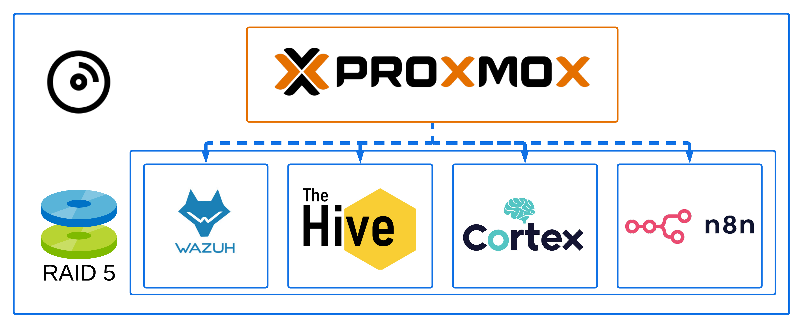

# Installation de Proxmox

Proxmox à été installé sur un serveur Dell équipé de 2 Intel Xeon de 6 coeurs chacuns, avec 96Go de RAM et 5 HDD de 300Go.  Un système RAID 0 est utilisé pour l'OS Proxmox, et RAID V pour les machines virtuelles au sein de Proxmox.

Pour plus d'informations, voir la documentation [ici](https://www.proxmox.com/en/products/proxmox-virtual-environment/get-started).

# Infrastructure interne

Proxmox nous est utile pour centraliser nos machines virtuelles sur un seul serveur. Cela nous permet de mettre en oeuvre un environnement de test avec moins de matériel et plus rapidement, mais aussi de réduire le coût et la maintenance de l'environement de production si Proxmox est conservé. Voici les VMs déployées au sein du Proxmox:

