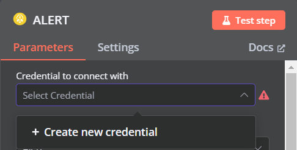
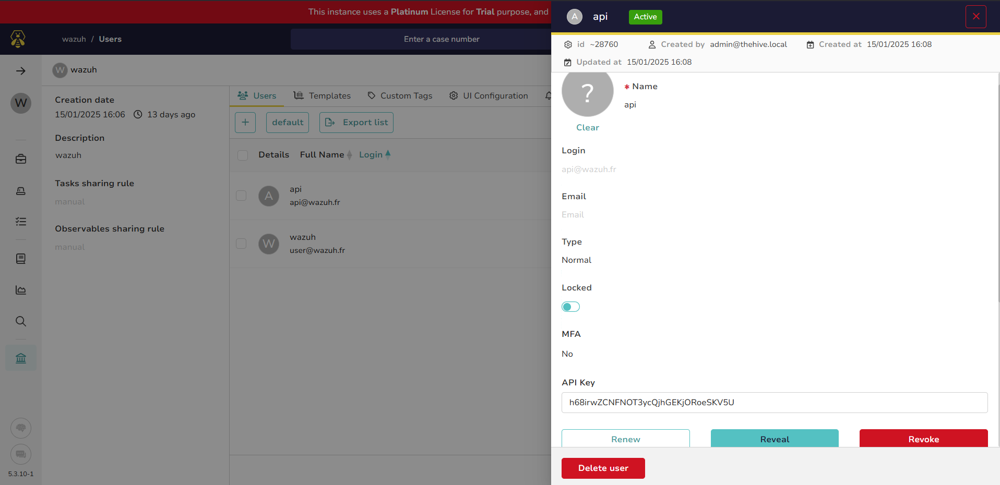
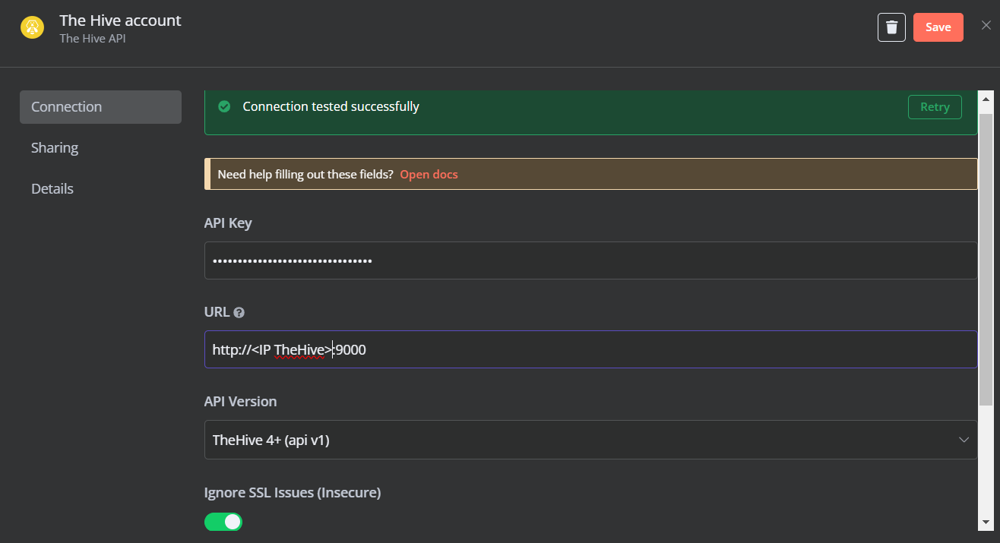

# Ajouts d'analyzers à Cortex
Pour chaque analyzer désiré, il faut se rendre dans la section `Organization` de Cortex pour choisir l'analyzer voulut. Ensuite il sera disponnible dans la seciton Analyzer.

## AbuseIPDB
Créer un compte, et récuperer la clé API

## VirusTotal
Créer un compte, et récuperer la clé API. Le script fournis de base n'est pas fonctionnel. Voici les modifications approtées pour le rendre fonctionnel:

Mise à jour du package virustotal et installation du package filetype:
```bash
pip install --upgrade vt-py --break-system-packages
pip install filetype --break-system-packages
```

Puis modifier le code python:

Remplacer:
```python
from vt import Client, error
```

Par:
```python
from vt import error
from vt.client import Client
```


# Création du workflow n8n  

Le workflow n8n à pour but d'automatiser certaines tâches de récupération de logs et de traitement. Cela représente généralement des tâches d'analyste N1. Le workflow créé vise à envoyer les alertes de niveau MEDIUM minium (Wazuh filtre lui même pour n'envoyer que du Medium) dans TheHive avec création ou merge dans un CASE adapté. Des observables sont également définies afin de lancer des analyzers tels que AbuseIPDB ou VirusTotal sur des IPs ou des URLs (nous n'avons pas mis en place d'analyzer sur le nom de domaine mais le worflow est prêt, il suffit de relier la partie sur le domaine et de configurer l'analyzer dans le noeud d'execution de l'analyzer).

Le workflow réalisé est donné [ici](./INSOC.json). Ce workflow utilise des node de code personnalisés dont voici les explications:

- Les noeuds TheHive permettent d'interagir avec les APIs de TheHive. Or, pour se faire il est nécessaire d'ajouter les autorisations à n8n par le biais de l'ajout du compte api de TheHive dans n8n:

Premièrement, dans le noeud TheHive il faut ajouter un compte:



Ensuite, via l'interface de TheHive, il faut récuperer la clé API de l'utilisateur créé à cet effet:


Finalement, en ajoutant cette clé api avec l'url de TheHive la connexion est faite:



- **/!\ Important**: le noeud TEST MALICOUS  à pour but de modifier l'ip de l'alerte afin de tester le workflow. Il faut faire click droit + Deactivate pour le bypass.

- Le noeud NORMALISE permet de normaliser la valeur des alertes dans {1,2,3}, ainsi TheHive sera en capacité de leur attribuer un label:
```python	
data = _input.first().json
level = data.body.rule.level

new_level = 1
if 5 < level <= 10:
  new_level = 2
elif 10 < level:
  new_level = 3

data.body.rule.level = new_level

return data
```

- Le noeud uuid permet de génerer un uuid pour chaque alerte afin de lui donner un identifiant unique, sans quoi TheHive refusera la création de l'alerte.
```python
# creates a uuid for each alert
import uuid

data = _input.first().json.body
data.sourceRef = str(uuid.uuid4())
return data
```

- Le noeud utilisé après la création de CASE ou merge de l'alerte dans un CASE permet de passer aux noeud suivants l'id du CASE créé ainsi que la date.
```python
return {
  'id': _input.first().json.id,
  'date': _input.first().json.createdAt
}
```

- En parallèle, un noeud est éxecuté pour tenter de détecter les potentielles données qui pourraient être une justification d'acte malvaillant (nommées artéfacts ou observables). Il cherches les adresses IP qui ne correspondent pas à des adresses du LAN, les noms de domaines et les urls.
```javascript
// Check if it's an external IP
function isExternalIP(ip) {
    const privateRanges = [
        /^10\.\d{1,3}\.\d{1,3}\.\d{1,3}$/,        // 10.0.0.0 - 10.255.255.255
        /^172\.(1[6-9]|2[0-9]|3[0-1])\.\d{1,3}\.\d{1,3}$/, // 172.16.0.0 - 172.31.255.255
        /^192\.168\.\d{1,3}\.\d{1,3}$/,           // 192.168.0.0 - 192.168.255.255
        /^127\.\d{1,3}\.\d{1,3}\.\d{1,3}$/,       // 127.0.0.0 - 127.255.255.255 (loopback)
        /^169\.254\.\d{1,3}\.\d{1,3}$/,           // 169.254.0.0 - 169.254.255.255 (link-local)
        /^0\.\d{1,3}\.\d{1,3}\.\d{1,3}$/,         // 0.0.0.0/8 (reserved)
        /^255\.255\.255\.255$/                    // Broadcast address
    ];

    return !privateRanges.some(range => range.test(ip));
}

function extractArtifacts() {
    const ipRegex = /\b\d{1,3}\.\d{1,3}\.\d{1,3}\.\d{1,3}\b/g;
    const urlRegex = /https?:\/\/(?:[-\w@:%._\+~#=]{1,256}\.[\w()]{1,6}\b(?:[-\w()@:%_\+.~#?&\/=]*))/g

    // Get the items array from n8n input
    const inputArray = $input.first().json.body;
    let artifactsDict = {};
    artifactsDict.artifacts = {}

    // Convert item to string if it's not already
    const formatAlt = JSON.stringify(inputArray, null, 2);

    const allIps = formatAlt.match(ipRegex) || [];
    artifactsDict.artifacts.ips = allIps.filter(isExternalIP); // Get only external IPs
    artifactsDict.artifacts.urls = formatAlt.match(urlRegex) || [];

    // Extract domains from URLs using simple string manipulation
    artifactsDict.artifacts.domains = artifactsDict.artifacts.urls.map(url => {
    // Remove protocol (http:// or https://)
    let domain = url.split('//')[1];
    // Get the domain part (everything before the first slash)
    domain = domain.split('/')[0];
    // Remove port if present
    domain = domain.split(':')[0];
    return domain;
    });

    return artifactsDict;
}


// Input data
const data = $input.first().json;

const dict = extractArtifacts();
data.body = dict;
data.body.counter_ips = dict.artifacts.ips.length;
data.body.counter_urls = dict.artifacts.urls.length;
data.body.counter_domains = dict.artifacts.domains.length;

return { json: data.body };
```

TODO: noeud qui update la liste locale des IPs malveillantes