# Documentation de l'agent Wazuh

## Documentation en ligne
- Documentation d'installation [Windows](https://documentation.wazuh.com/current/installation-guide/wazuh-agent/wazuh-agent-package-windows.html)
- Documentation d'installation [Linux](https://documentation.wazuh.com/current/installation-guide/wazuh-agent/wazuh-agent-package-linux.html)

## Notre installation de l'agent avec Sysmon

### 1) Activation de Wazuh Agent

Sur l’interface du serveur Wazuh, on peut accéder au déploiement d’agents via Endpoints > Deploy New Agent dans lequel on suivra les étapes fournies pour déployer l’agent Wazuh.

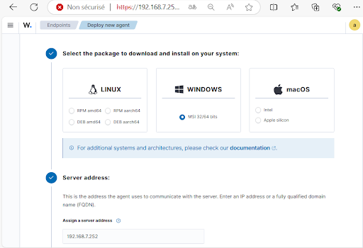

Le système d’exploitation utilisé par nos machines est Windows qu’on sélectionne, ensuite on saisit l’adresse ip du serveur Wazuh qui est 192.168.7. On a aussi la possibilité de nommer nos agents de façon à les reconnaître plus facilement que par les noms d’hôtes par défaut.

Ensuite on saisit la commande suivante sur Powershell en tant qu’administrateur pour installer l’agent:

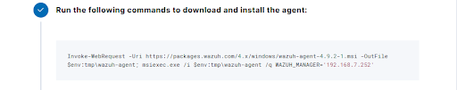

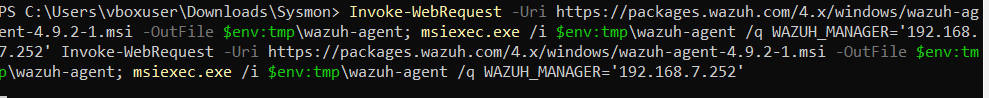


Ensuite, on saisit la commande suivante pour démarrer l’agent:


On peut s’assurer du démarrage de l’agent en vérifiant directement sur Services.

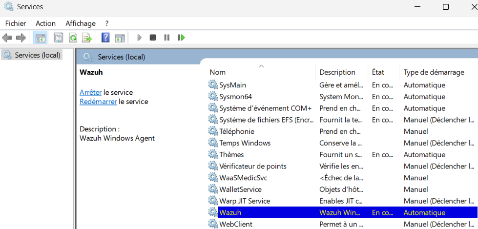


Sur l’interface du serveur Wazuh, on peut voir toutes les machines agent déployées avec leurs statuts, adresses IP, OS correspondant etc...

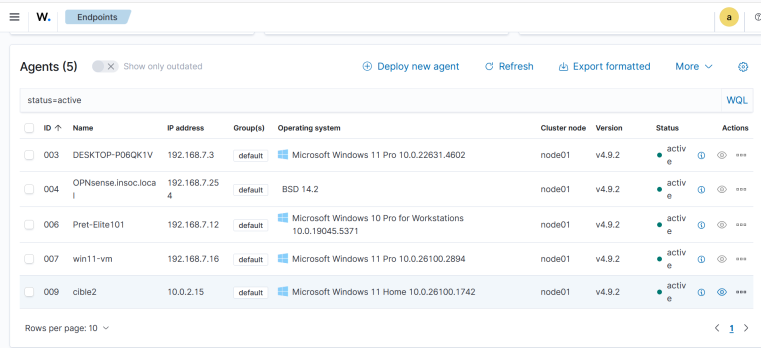


### 2) Installation de Sysmon

On suit ce guide pour activer sysmon dans Wazuh Agent, section 3.1 et 4.1. https://github.com/uruc/SOC-Automation-Lab?tab=readme-ov-file
On installe d’abord sysmon et extrait son contenu dans un dossier. _/Sysmon_ https://learn.microsoft.com/fr-fr/sysinternals/downloads/sysmon

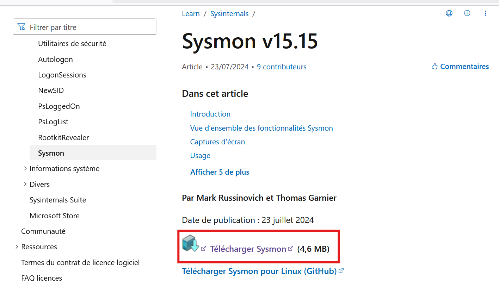

On télécharge le fichier _sysmonconfig.xml_ depuis le lien https://github.com/olafhartong/sysmon-modular/blob/master/sysmonconfig.xml

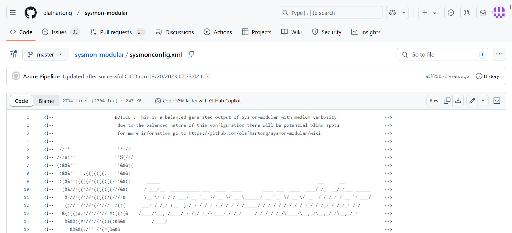

Et on le place dans le dossier. _/Sysmon_ On obtient l’arborescence suivante :

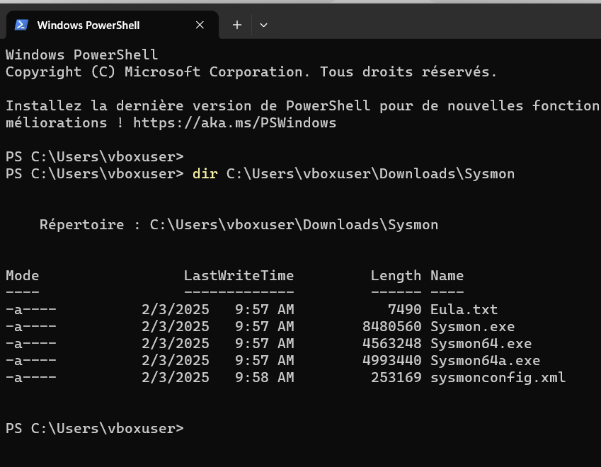

Puisque Sysmon n'est pas installé, on procède à l'installation en utilisant la commande : .\Sysmon64.exe -i .\sysmonconfig.xml

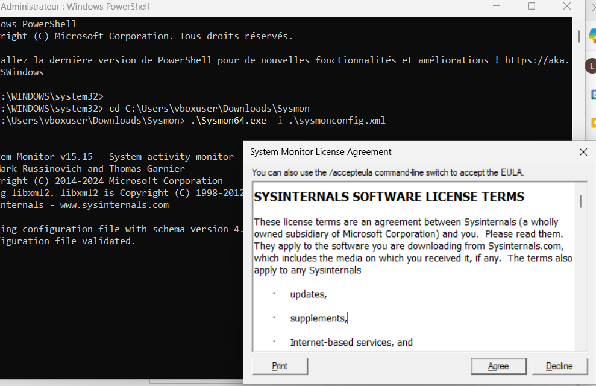

et on s’assure qu’il est bien actif dans _Services_

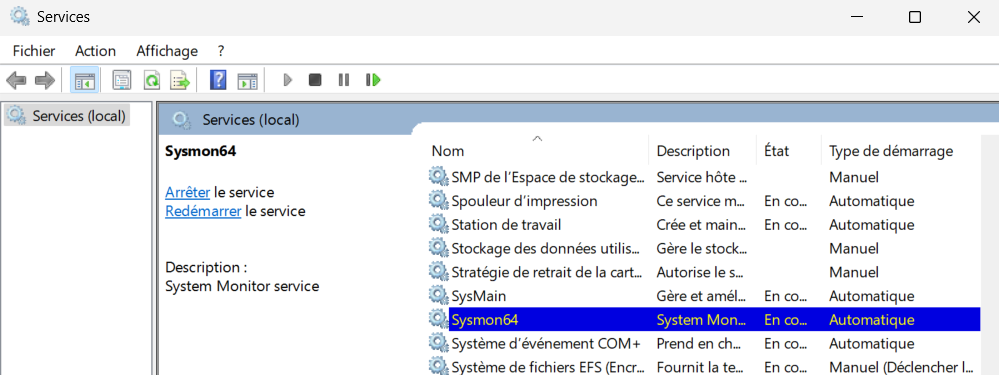

On ouvre Wazuh manager,

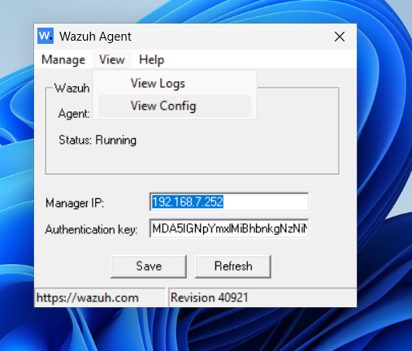

On accède à View Config pour ajouter ces lignes à ossec.conf au dessous des lignes localfile déjà présentes:

`<localfile>`

`    <location>Microsoft-Windows-Sysmon/Operational</location>`

`    <log_format>eventchannel</log_format>`

`</localfile>`

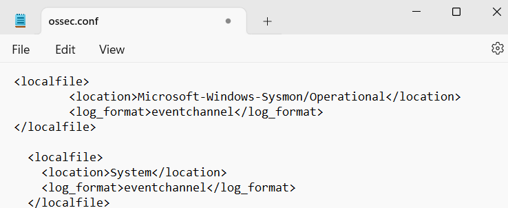

On redémarre l’agent pour enregistrer les modifications:

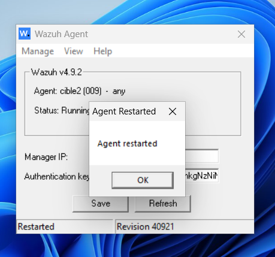


## Active Response
### Windows
Sur l'endpoint, déposer les script dans `C:\Program Files (x86)\ossec-agent\active-response\bin`. Vous trouverez sur le répo Github d'@B3LIOTT les [scripts d'active response](https://github.com/B3LIOTT/wazuh-active-response).


### Linux
Dans `/var/ossec/active-response/bin`, déposer les scripts puis:
```bash
sudo chmod 750 /var/ossec/active-response/bin/<CUSTOM_SCRIPT>
sudo chown root:wazuh /var/ossec/active-response/bin/<CUSTOM_SCRIPT>
```

Pour plus d'info, voir la doc [Active Response](https://documentation.wazuh.com/current/user-manual/capabilities/active-response/index.html).
