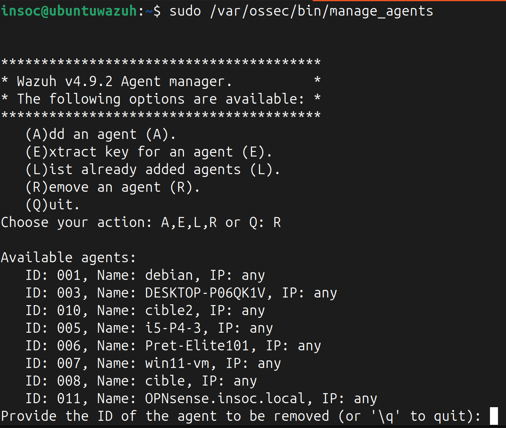

# Documentation du serveur Wazuh

## Installation
L'installation fut effectuée sur une machine Linux, Ubuntu-server-24.04. L'indexer, le server et le dashboard sont sur la même machine:
Documentation d'[Installation](https://documentation.wazuh.com/current/installation-guide/index.html).


## Suppression d'un agent
Lors du test de notre infrastructure, nous nous sommes rendus compte que l'agent Wazuh installé sur le firewall OPNSense ne transmettait plus correctement ses informations au serveur.

Nous avons donc décidé de le supprimer et de le réinstaller pour qu'il puisse correctement fonctionner.

Cependant, il s'est avéré que ce nouvel agent ne parvenait pas à se connecter car son ancienne instance était toujours comptabilisée sur le serveur Wazuh.

Ainsi, il a fallu supprimer de la liste des agents connus par le serveur cette ancienne instance.

Pour cela, il suffit de se connecter en SSH au serveur Wazuh, et d'utiliser l'outil `manage_agent` en usant de la commande suivante :
```bash
sudo /var/ossec/bin/manage_agents
```
Il suffit ensuite d'utiliser l'option `R (Remove)` et d'entrer l'ID de l'agent en défaut parmi la liste des ID disponibles.



## Active Response
Les active response sont des scripts qui, lorsqu'une certaine règle d'un sensemble (ou d'un certain niveau d'alerte) provoque une alerte, executent des actions sur l'endpoint concerné et/ou le serveur.
Vous trouverez sur le répo Github d'@B3LIOTT les [scripts d'active response](https://github.com/B3LIOTT/wazuh-active-response).

La configuration s'effectue via la modification de `/var/ossec/etc/ossec.conf`:
- ajout de la commande personnalisée pour chaque script

  Exemple:
  ```conf
  <command>
      <name>exemple</name>
      <executable>exemple.exe</executable>
      <timeout_allowed>yes</timeout_allowed>
  </command>
  ```

- ajout du block d'active response pour chaque active response

  Exemple:
    ```conf
   <active-response>
      <command>exemple</command>
      <location>local</location>
      <rules_id>503</rules_id>
      <timeout>30</timeout>
  </active-response>
  ```

Pour plus de détails, voir la documentation Wazuh [active response](https://documentation.wazuh.com/current/user-manual/capabilities/active-response/how-to-configure.html) et [osser-conf](https://documentation.wazuh.com/current/user-manual/reference/ossec-conf/active-response.html#command).
