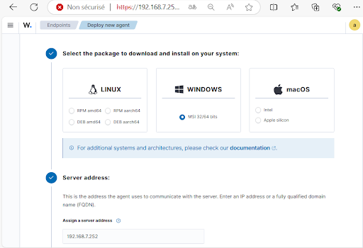

# Configuration de l’environnement de test

## 1) Activation de Wazuh Agent

Sur l’interface du serveur Wazuh, on peut accéder au déploiement d’agents via Endpoints > Deploy New Agent dans lequel on suivra les étapes fournies pour déployer l’agent Wazuh.

Le système d’exploitation utilisé par nos machines est Windows qu’on sélectionne,
ensuite on saisit l’adresse ip du serveur Wazuh qui est 192.168.7.
On a aussi la possibilité de nommer nos agents de façon à les reconnaître plus
facilement que par les noms d’hôtes par défaut.
Ensuite on saisit la commande suivante sur Powershell en tant qu’administrateur
pour installer l’agent:

Ensuite, on saisit la commande suivante pour démarrer l’agent:
On peut s’assurer du démarrage de l’agent en vérifiant directement sur Services.

Sur l’interface du serveur Wazuh, on peut voir toutes les machines agent déployées
avec leurs statuts, adresses IP, OS correspondant etc...

## 2) Installation de Sysmon

On suit ce guide pour activer sysmon dans Wazuh Agent, section 3.1 et 4.1.
https://github.com/uruc/SOC-Automation-Lab?tab=readme-ov-file
On installe d’abord sysmon et extrait son contenu dans un dossier. _/Sysmon_
https://learn.microsoft.com/fr-fr/sysinternals/downloads/sysmon

On télécharge le fichier _sysmonconfig.xml_ depuis le lien
https://github.com/olafhartong/sysmon-modular/blob/master/sysmonconfig.xml
Et on le place dans le dossier. _/Sysmon_
On obtient l’arborescence suivante :
Puisque Sysmon n'est pas installé, on procède à l'installation en utilisant la
commande :
.\Sysmon64.exe -i .\sysmonconfig.xml

et on s’assure qu’il est bien actif dans _Services_
On ouvre Wazuh manager,

On accède à View Config pour ajouter ces lignes à ossec.conf au dessous des
lignes localfile déjà présentes:
<localfile>
<location>Microsoft-Windows-Sysmon/Operational</location>
<log_format>eventchannel</log_format>
</localfile>
On redémarre l’agent pour enregistrer les modifications:

## 3) Installation de Atomic Red Team

On suit ce tutoriel
https://www.youtube.com/watch?v=_xW3fAumh1c
On télécharge les fichiers en Zip de ces deux repository
GitHub - redcanaryco/atomic-red-team: Small and highly portable detection tests
based on MITRE's ATT&CK.

GitHub - redcanaryco/invoke-atomicredteam: Invoke-AtomicRedTeam is a
PowerShell module to execute tests as defined in the [atomics
folder](https://github.com/redcanaryco/atomic-red-team/tree/master/atomics) of Red
Canary's Atomic Red Team project.
On crée le dossier C:\AtomicRedTeam
On y déplace les deux après extraction. On change le nom du dossier de
_invoke-atomicredteam-master_ à _invoke-atomicredteam_ et on déplace le dossier
atomics de _C:\AtomicredTeam\atomic-red-team-master_ vers
_C:\AtomicredTeam\atomic-red-team-master_

On ouvre le powershell en admin et exécute ces trois commandes:
powershell -exec bypass
Install-Module -Name invoke-atomicredteam,powershell-yaml -Scope
CurrentUser
Import-Module
“C:\AtomicRedTeam\invoke-atomicredteam\Invoke-AtomicRedTeam.psd1”
-Force
Si vous rencontrez des problèmes de confiance, exécutez ces commandes:
Install-Module -Name powershell-yaml -Force -Scope CurrentUser
Set-PSRepository -Name PSGallery -InstallationPolicy Trusted
Nous exécutons les attaques Atomic Red Team pour les quatre catégories
suivantes: **l’impact, la reconnaissance, la persistance et l'escalade de
privilèges**. Ces attaques simulent des techniques utilisées pour contourner la
sécurité, explorer des systèmes, maintenir un accès persistant et obtenir des
privilèges élevés, dans le but de tester la résistance des systèmes face à ces
menaces.
Pour lancer les attaques:
powershell -exec bypass

Install-Module -Name powershell-yaml -Force -Scope CurrentUser
Import-Module
“C:\AtomicRedTeam\invoke-atomicredteam\Invoke-AtomicRedTeam.psd1”
-Force
On lance l’attaque et enregistre les détails dans un fichier json
Invoke-AtomicTest T1016 -LoggingModule "Attire-ExecutionLogger"
-ExecutionLogPath "T1016-Windows.json"
On peut récupérer les détails de l’attaque comme suit:
Pour inverser l’attaque, on lance la commande suivante:
Invoke-AtomicTest T1546.002 -Cleanup

## 4) Détection par Wazuh

Nous avons décidé d'organiser les informations relatives aux attaques MITRE dans
un fichier Excel structuré, afin de faciliter le suivi et l'analyse des détections.
Ce fichier inclut des éléments clés tels que l'indication de la détection de l'attaque,
les règles par défaut susceptibles de l'avoir détectées, ainsi que les règles
personnalisées que nous avons mises en place pour améliorer cette détection. Nous
y ajouterons également le temps nécessaire pour identifier l'attaque.
Cette organisation nous permettra d'évaluer l'efficacité de notre stratégie de
détection et d'adapter nos réponses en conséquence.
Le tableau Excel est structuré pour documenter les attaques testées dans le cadre
de l’évaluation du SOC selon la méthodologie suivante :

1. **Catégorisation des attaques** : Les attaques sont regroupées en quatre
    grandes catégories (ex. Reconnaissance, Persistance, etc.), conformément
    aux matrices MITRE ATT&CK.
2. **Identification des attaques et sous-techniques** : Pour chaque attaque,
    nous précisons l’ID MITRE principal ainsi que les sous-techniques testées
    (par exemple, T1547.001 pour les clés de registre d’exécution automatique).
3. **Mise en évidence des attaques non testées** : Les attaques qui n’ont pas
    été simulées sont surlignées en gris pour une distinction visuelle rapide.

4. **Règles Wazuh par défaut** : Nous listons les règles par défaut de Wazuh qui
    permettent de détecter l’activité malveillante. Chaque règle est identifiée par
    son ID unique, facilitant leur traçabilité dans les logs.
5. **Statut de détection** :
    ○ La colonne "Détection" est mise à **oui** si au moins une règle Wazuh par
       défaut détecte l’activité.
    ○ Elle est mise à **non** si aucune règle par défaut ne remonte l’attaque.
6. **Ajout de règles Wazuh Sysmon personnalisées** : Que l’attaque soit
    détectée ou non, des règles Sysmon personnalisées sont ajoutées pour
    enrichir les capacités de détection. Ces règles capturent des événements
    critiques comme les modifications de registre (Event 13), les exécutions de
    processus suspects (Event 10), ou les connexions réseau anormales.
Les règles Windows Sysmon on été prise de ce repository:
https://github.com/socfortress/Wazuh-Rules/tree/main/Windows_Sysmon
Ce processus permet de centraliser et d’analyser précisément les performances des
détections, en mettant en évidence les lacunes et en renforçant les règles existantes
pour améliorer la couverture du SOC.

## 5) Règles personnalisées

Les règles personnalisées ajoutées sont regroupées en 13 types d'événements
Sysmon :
Événement 1 : correspond à la création d'un processus. Il est utilisé pour surveiller
les processus exécutés sur une machine Windows, pour identifier des exécutions
suspectes, comme l'utilisation d'outils malveillants, l'exploitation de failles ou des
mouvements latéraux dans un réseau.
Événement 2 : correspond à la modification de l’horodatage d’un fichier. Cet
événement est souvent utilisé par les attaquants pour masquer leurs activités en
modifiant la date de création ou de modification d’un fichier, une technique connue
sous le nom de Timestomping.
Événement 3 : concerne la création de connexions réseau par un processus. Il
permet de surveiller quelles applications établissent des connexions sortantes ou
entrantes, ce qui est crucial pour détecter les activités malveillantes comme le
Command & Control (C2), l'exfiltration de données, ou l'utilisation d'outils de hacking.
Événement 7 : concerne la création d’un thread distant, ce qui peut indiquer une
tentative d’injection de code dans un autre processus.
Événement 10 : concerne la modification des autorisations d'un processus. Il est
souvent utilisé pour détecter des tentatives d'élévation de privilèges ou des
comportements suspects liés aux droits des processus.

Événement 11 : concerne le chargement d’un module (DLL) par un processus. Cet
événement est essentiel pour détecter les attaques par injection de DLL et
l’utilisation de bibliothèques malveillantes.
Événement 12 : Ces événements surveillent les modifications apportées au registre
Windows, notamment la création et la suppression d'objets. Ils permettent de
détecter des activités suspectes comme l'exécution persistante, la manipulation des
comptes, la modification des paramètres de sécurité ou encore l'évasion des
défenses.
Événement 13 : Ces événements concernent les modifications des valeurs du
registre Windows. Ces événements permettent de détecter des actions malveillantes
telles que la persistance via les clés Run, la manipulation des comptes, l’évasion des
défenses, ou l’injection de DLLs. Ils sont essentiels pour la surveillance de la
sécurité et l’investigation des compromissions du système.
Événement 14 : Ces événements surveillent les modifications des clés et valeurs du
registre Windows, ce qui peut indiquer des tentatives de persistance ou d'escalade
de privilèges par des attaquants. Ces événements sont souvent liés à des
techniques MITRE ATT&CK telles que la manipulation des comptes, le
détournement de DLL, ou la désactivation des mécanismes de défense. Leur
détection permet d'identifier des activités suspectes affectant le démarrage du
système, l'authentification, ou les paramètres de sécurité.
Événement 15 : concerne l’enregistrement d’un accès direct au disque. Il permet de
détecter les activités suspectes où un processus tente d’accéder directement à un
périphérique de stockage, ce qui peut être utilisé pour contourner les protections du
système de fichiers.
Événement 17 : concerne les modifications des paramètres du registre Windows**.**
Cet événement est crucial pour surveiller les altérations du registre qui peuvent
indiquer des comportements malveillants ou des tentatives de persistance sur le
système.
Événement 18 : concerne la création d'un handle (descripteur) à un objet sensible du
système, ce qui peut être un indicateur d’activités malveillantes liées à l'injection de
code ou l'escalade de privilèges.
Événement 22 : Ces événements concernent les requêtes DNS effectuées par des
processus, ce qui peut indiquer des tentatives de communication réseau,
potentiellement pour des activités malveillantes telles que l'exfiltration de données ou
la connexion à un serveur C2.

Parmi les alertes reçues correspondants aux règles ajoutées:
106110 Sysmon - Event 7: Image loaded by
C:\\Windows\\System32\\wbem\\WmiPrvSE.exe
106104 Sysmon - Event 7: Image loaded by
C:\\Windows\\System32\\WindowsPowerShell\\v1.0\\powershell.exe
106119 Sysmon - Event 7: Image loaded by
C:\\Windows\\System32\\WindowsPowerShell\\v1.0\\powershell.exe
Pour les ID de règles ci-dessus, l'événement 7 dans Sysmon signale qu'une image
(un fichier exécutable ou un module) a été chargée par un processus. Dans ces
exemples, l'image est chargée par _WmiPrvSE.exe_ et _powershell.exe._

- _WmiPrvSE.exe_ est un processus lié à Windows Management Instrumentation
    (WMI), utilisé pour l'exécution de scripts et de requêtes système. Il est
    souvent légitime, mais il peut aussi être abusé par des attaquants pour
    exécuter des commandes ou charger des malwares.
- _powershell.exe_ est l'exécutable principal de PowerShell que les attaquants
    peuvent également l'utiliser pour exécuter des scripts malveillants.
106101 Sysmon Event 7: Image Loaded (cscript.exe)
Cet événement enregistre le chargement de bibliothèques DLL par cscript.exe, ce
qui peut être exploité par des attaquants pour exécuter du code malveillant par le
biais d’une attaque par DLL hijacking. Si cscript.exe charge une bibliothèque
inhabituelle ou non signée, cela pourrait indiquer un comportement suspect
nécessitant une investigation approfondie.
106118 Sysmon Event 7: Unsigned Image loaded by chrome.exe
Cet événement signale que Chrome a chargé une image non signée depuis un
répertoire temporaire (AppData\Local\Temp\chrome-win\). Ce comportement est
inhabituel et peut indiquer une tentative d’injection de DLL malveillante ou
l’exécution d’un malware déguisé en Chrome. Il faut analyser si chrome.exe est
légitime, examiner les DLL chargées et vérifier les connexions réseau associées.
106116 Sysmon Event 7: Image loaded by taskhostw.exe
Cet événement associé à taskhostw.exe indique que ce processus a chargé une
image. Bien que taskhostw.exe soit un processus système légitime, ce
comportement peut être lié à une exécution de code malveillant via DLL hijacking. Il
est crucial de vérifier la signature de la DLL et d’analyser si le fichier taskhostw.exe
est authentique.

106103 Sysmon - Event 7: Image loaded by
C:\\ProgramData\\Microsoft\\Windows
Defender\\Platform\\4.18.24090.11-0\\MsMpEng.exe
Cet événement montre que MsMpEng.exe, le moteur d’analyse de Windows
Defender, a chargé une image. En temps normal, ce comportement est légitime,
mais il peut être intéressant de vérifier si une DLL malveillante a été injectée dans ce
processus pour échapper à la détection de l’antivirus.
100125 Sysmon - Event 1: Process creation WMI Provider Host
L'événement 1 indique qu'un processus a été créé sur le système. Ici dans cet
exemple, le processus qui a été lancé est _WMI Provider Host_ , un processus système
lié à la gestion WMI sur Windows. Ce processus est souvent exécuté pour permettre
des interactions avec les composants système via WMI. Il est également un vecteur
potentiel pour les attaques si un attaquant a l'intention de l'utiliser pour manipuler ou
exécuter des commandes sur le système.
100112 Sysmon Event 1: Process Creation (whoami) - displays logged
on user information
Cet événement indique la création du processus whoami.exe, une commande
utilisée pour afficher des informations sur l'utilisateur actuellement connecté. Bien
que couramment utilisée par les administrateurs, cette commande est aussi
exploitée par les attaquants après une compromission pour identifier leurs privilèges
et les comptes accessibles. Une exécution suspecte de whoami.exe peut donc être
un signe de reconnaissance effectuée dans le cadre d'une attaque.
100126 Sysmon Event 1: Process Creation (Microsoft Console Based
Script Host - cscript.exe)
Cet événement indique que cscript.exe, un interpréteur de scripts pour Windows
Script Host (WSH), a été exécuté. Cet outil est utilisé pour exécuter des scripts en
VBScript ou JScript, mais il est souvent détourné par des attaquants pour exécuter
du code malveillant. Une exécution anormale de cscript.exe peut donc être un
indicateur d’activité malveillante, nécessitant une analyse des scripts exécutés.
100117 Sysmon Event 1: Process Creation (powershell.exe)
Cet événement montre que powershell.exe a été exécuté. PowerShell est
couramment utilisé par les administrateurs, mais aussi par des attaquants dans des
attaques Living Off The Land Binaries (LOLBins) pour exécuter des scripts
malveillants sans éveiller les soupçons. Une exécution suspecte de PowerShell doit
être analysée, notamment en vérifiant si des commandes dangereuses ont été
utilisées.
100117 Sysmon Event 1: Process Creation (Microsoft Edge WebView2)

Cet événement indique l’exécution de Microsoft Edge WebView2, un composant
permettant d’intégrer du contenu web dans des applications Windows. Bien que
légitime, certains malwares exploitent WebView2 pour charger des pages
malveillantes ou exécuter du code JavaScript malicieux. Une surveillance des
processus associés est nécessaire pour détecter toute utilisation abusive.
100106 Sysmon Event 1: Process Creation
Cet événement signale la création d’un processus sans plus de détails dans l’alerte.
Selon le processus concerné, cet événement peut être bénin ou au contraire
révélateur d’une activité malveillante. Une analyse plus approfondie est nécessaire
pour comprendre s’il s’agit d’un processus légitime ou suspect.
100171 Sysmon - Event 1: Process creation Visual C# Command Line
Compiler
Ici dans cet exemple d’alerte, l'événement 1 dans Sysmon signale qu'un nouveau
processus a été créé sur le système. Dans ce cas, le processus créé est Visual C#
Command Line Compiler, ou _csc.exe_ , qui est l'outil de compilation en ligne de
commande utilisé pour compiler des programmes C#. La création d'un processus
comme _csc.exe_ peut être utilisé de manière malveillante par des attaquants pour
compiler et exécuter du code malveillant de manière discrète.
112143 Sysmon - Event 13: RegistryEvent by
C:\\WINDOWS\\System32\\WindowsPowerShell\\v1.0\\powershell.exe
L'événement 13 ci-dessus fait référence à une opération qui a lieu dans le registre
Windows qui a été initié par powershell.exe. Cela signifie que PowerShell a interagi
avec le registre, ce qui est souvent utilisé pour créer ou modifier des clés de registre,
ajouter des entrées ou exécuter des commandes liées à la configuration système.
Ceci peut donc être utilisé par des attaquants pour des fins malveillantes.
112105 Sysmon Event 13: RegistryEvent (Modification du registre
par powershell.exe)
Cet événement signifie qu’un processus powershell.exe a modifié une valeur du
registre Windows. PowerShell est un outil puissant utilisé par les administrateurs
mais également par des attaquants pour établir une persistance ou exécuter du code
malveillant. Si la modification du registre est inhabituelle, cela pourrait être le signe
d’une attaque utilisant PowerShell, comme l’ajout d’une clé Run pour exécuter du
code malveillant au démarrage.
112120 Sysmon Event 13: RegistryEvent (Value Set) by svchost.exe
L’événement 13 montre que svchost.exe a modifié des clés de registre. Ce
comportement peut indiquer la mise en place d’une persistance malveillante, par
exemple via les Run Keys, les tâches planifiées ou les services système. Il est

nécessaire d’identifier les clés de registre modifiées et de vérifier si une nouvelle
entrée de démarrage automatique a été ajoutée.
112103 Sysmon - Event 13: RegistryEvent (Value Set) by
C:\\WINDOWS\\System32\\WindowsPowerShell\\v1.0\\powershell.exe
Cet événement signale que PowerShell a modifié une clé de registre. Cela pourrait
être une tentative de persistance, par exemple via les clés Run, RunOnce ou
PowerShell Transcription Logging. Une analyse approfondie des valeurs modifiées
permettra de déterminer si un attaquant tente d’assurer une présence sur la
machine.
109102 Sysmon Event 10: ProcessAccess by
C:\\WINDOWS\\System32\\WindowsPowerShell\\v1.0\\powershell.exe
L'événement ci-dessus signale qu'un processus a accédé à un autre processus.
Dans cet exemple, il semble que powershell.exe ait accédé à un autre processus en
cours d'exécution sur le système. Ce type d'accès est souvent légitime (par
exemple, PowerShell peut interagir avec d'autres processus pour récupérer des
informations ou les manipuler), mais il peut aussi être utilisé dans des attaques pour
injecter du code ou surveiller d'autres processus.
109103 Sysmon Event 10: ProcessAccess by OneDrive.exe
Cet événement montre que OneDrive.exe tente d’accéder à un autre processus.
Cela peut être un comportement normal dans certains cas, mais également un signe
d’injection de code. Il faut identifier le processus cible et s’assurer que OneDrive.exe
n’a pas été remplacé par un binaire malveillant.
102138 Sysmon - Event 3: Network connection by
C:\\ProgramData\\Microsoft\\Windows
Defender\\Platform\\4.18.24090.11-0\\MsMpEng.exe
L'événement 3 de Sysmon est déclenché lorsqu'un processus tente d'établir une
connexion réseau (via TCP ou UDP). Cela inclut des informations sur le processus
qui initie la connexion, ainsi que des détails sur l'adresse IP et le port auxquels il
tente de se connecter.
Dans cet exemple, _MsMpEng.exe_ est l'exécutable du moteur de protection de
Windows Defender. Ce processus est responsable de la détection des menaces, de
l'analyse des fichiers et de la gestion des protections en temps réel contre les
malwares. Cependant, si _MsMpEng.exe_ se connecte à des serveurs ou adresses IP
inconnus ou non autorisés, cela pourrait indiquer un comportement anormal ou un
compromis.

102133 Sysmon Event 3: Network connection by rundll32.exe
Cet événement montre que rundll32.exe a initié une connexion réseau. Ce
programme est souvent détourné par des attaquants pour exécuter du code
arbitraire à partir de DLL malveillantes. Il faut identifier l’adresse de destination, la
DLL impliquée et surveiller l’activité des processus enfants créés par rundll32.exe.
102117 Sysmon - Event 3: Network connection by
C:\\Windows\\System32\\WindowsPowerShell\\v1.0\\powershell.exe
Cet événement indique que PowerShell a initié une connexion réseau. PowerShell
est souvent utilisé par les attaquants pour exfiltrer des données, télécharger des
scripts malveillants ou établir une communication avec un serveur distant. Il est
essentiel d’examiner l’adresse de destination, les paramètres de la commande
exécutée et l’éventuelle présence de scripts cachés (-EncodedCommand, iex,
Invoke-WebRequest, etc.).
121101 Sysmon - Event 22: DNS Request by
C:\\Windows\\System32\\WindowsPowerShell\\v1.0\\powershell.exe
L'événement 22 de Sysmon est déclenché lorsqu'un processus effectue une requête
DNS pour résoudre un nom de domaine en adresse IP. Cet événement enregistre
des informations sur le processus qui a initié la requête DNS, ainsi que les détails de
la requête elle-même. Dans ce cas, une requête DNS a été effectuée par
_powershell.exe._ Cela peut être dû à l'exécution d'un script PowerShell qui tente de
résoudre un nom de domaine
110105 Sysmon Event 11: File Create by svchost.exe
Cet événement indique que svchost.exe a créé un fichier. Étant donné que
svchost.exe est un processus utilisé pour exécuter des services Windows, la
création de fichiers par ce binaire peut être suspecte, notamment si elle est associée
au dépôt d’une charge utile malveillante. Il faut examiner le fichier créé, ses
métadonnées et son contenu, tout en surveillant son éventuelle exécution par un
autre processus.

