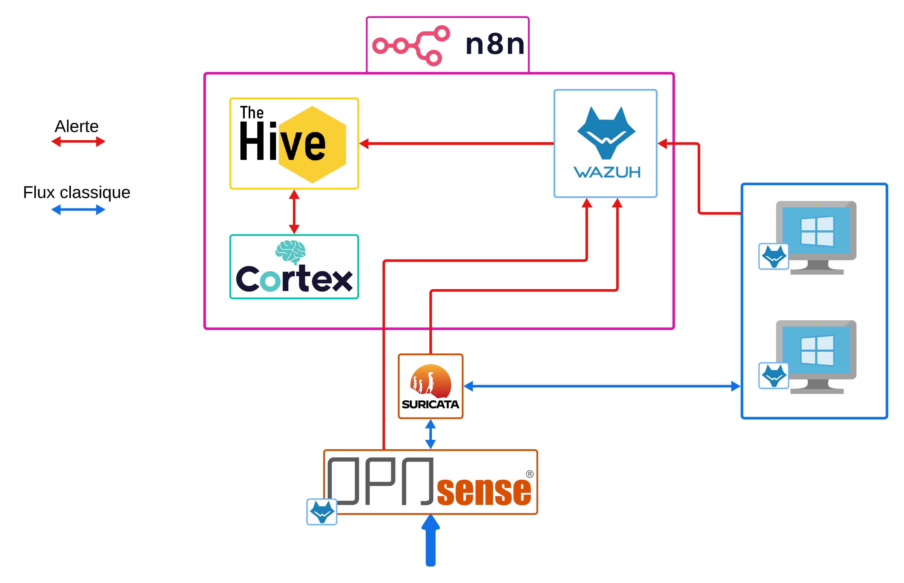
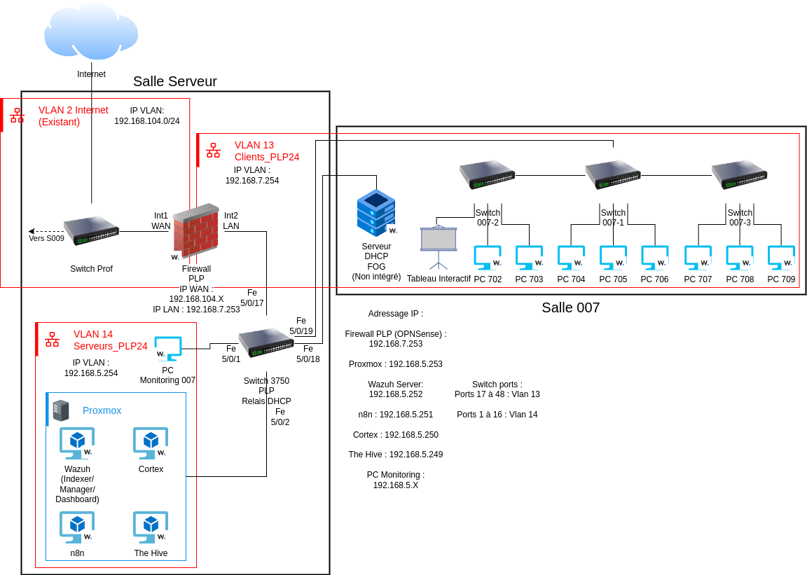

# INSOC-doc
Ce répo Github contient toute la documentation du projet INSOC proposé par Mr Ridet (enseignant à l'INSA Hauts de France) dans le cadre des Plateaux Projets (PLP) 2024-2025.


# Motivation
Dans le cadre de nos études à l’INSA Hauts de France, lors de notre dernière année, un projet nommé
Plateau Projet est imposé. Celui-ci constitue la dernière étape avant l’entrée dans le monde profession-
nel, et permet donc de mettre en application les notions apprises tout en dressant une atmosphère de
recherche et d’apprentissage. Nous, étudiants dans la spécialité cybersécurité, avons choisi de nous lan-
cer dans le projet de réalisaiton d’un SOC pour la salle de cyberdéfense de l’INSA Hauts de France,
proposé par Jérome Ridet 

# Répos Github associés
- [Cette documentation](https://github.com/B3LIOTT/INSOC-doc)
- [Siem Board](https://github.com/B3LIOTT/siem-board)
- [Golang n8n-wazuh](https://github.com/B3LIOTT/golang-n8n-wazuh)
- [Active response](https://github.com/B3LIOTT/wazuh-active-response)


# Documentation
- [1 - Switch et VLANS](1-Switch-et-VLANs/)
- [2 - OPNSense-Suricata-Squid-ZenArmor](2-OPNSense-Suricata-Squid)
- [3 - Proxmox](3-Proxmox)
- [4 - SOAR](4-SOAR)
- [5 - Wazuh](5-Wazuh)
- [6 - Visualisation](6-Visualisation)
- [7 - Tests](7-Tests)

La documentation est en markdown mais peut etre convertie en html via le script python `md-to-html.py`.

Ensuite, pour profiter de la mise en forme du code avec le css vous devez lancer la doc sur un server http local:
```bash
python -m http.server 8080
```
Et aller à `http://localhost:8080`

# Structure du projet
Le projet peut être présenté sous 2 angles: le workflow et l'infrastructure.

## Worfklow


## Infrastructure

