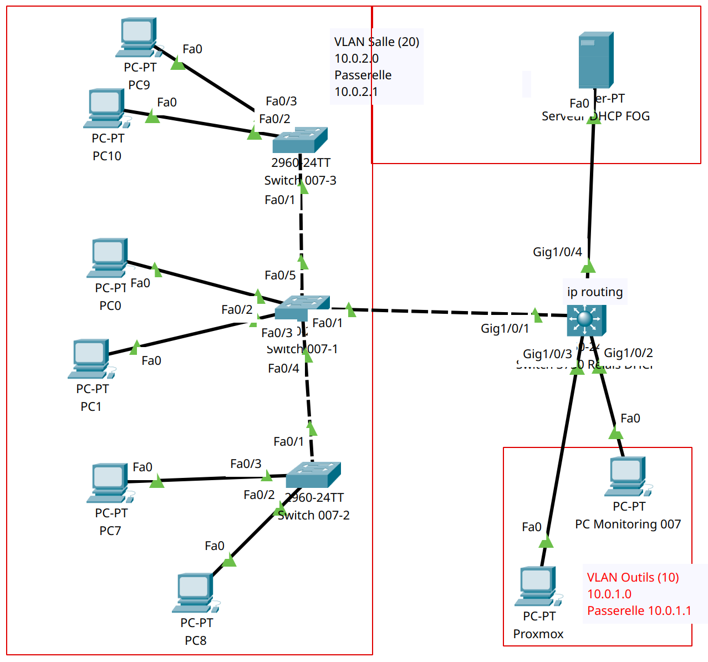

# Mise en place de VLANs pour le projet

Soit l'infrastructure suivante reproduite sur Packet Tracer:



## Configuration des VLANs sur les Switches

### Configuration du Switch 3650 (Switch Relais DHCP)
1. Création des VLANs :
```
en
conf t
vlan 10
name Outils
vlan 20
name Salle
exit
```
2. Assignation des interfaces aux VLANs :
- Interface vers le Proxmox (VLAN Outils):
```
en
conf t
int GigabitEthernet1/0/3
switchport mode access
switchport access vlan 10
exit
```
- Interface vers le 1er Switch 2960 (trunk):
```
en
conf t
int GigabitEthernet1/0/1
switchport mode trunk
switchport trunk allowed vlan 10,20
exit
```
- Interface vers le FOG (VLAN Salle):
```
en
conf t
int GigabitEthernet1/0/4
switchport mode access
switchport access vlan 20
exit
```

### Configuration des Switches 2960 constituants le réseau utilisateur
1. Création des VLANs sur tous les Switches de la salle :
```
en
conf t
vlan 20
name Salle
exit
```
2. Assignation des interfaces aux VLANs :
- Switch 007-1:
  - Interface vers le Switch 3650 (trunk):
    ```
    en
    conf t
    int FastEthernet0/1
    switchport mode trunk
    switchport trunk allowed vlan 10,20
    exit
    ```
  - Interface vers les PCs (VLAN Salle):
    ```
    en
    conf t
    int range FastEthernet0/2-3
    switchport mode access
    switchport access vlan 20
    exit
    ```
  - Interface vers le Switch 007-2 (trunk):
    ```
    en
    conf t
    int FastEthernet0/4
    switchport mode trunk
    switchport trunk allowed vlan 10,20
    exit
    ```
  - Interface vers le Switch 007-3 (trunk):
    ```
    en
    conf t
    int FastEthernet0/5
    switchport mode trunk
    switchport trunk allowed vlan 10,20
    exit
    ```
- Switch 007-2:
  - Interface vers le Switch 007-1 (trunk):
    ```
    en
    conf t
    int FastEthernet0/1
    switchport mode trunk
    switchport trunk allowed vlan 10,20
    exit
    ```
  - Interface vers les PCs (VLAN Salle):
    ```
    en
    conf t
    int range FastEthernet0/2-3
    switchport mode access
    switchport access vlan 20
    exit
    ```
- Switch 007-3:
  - Interface vers le Switch 007-1 (trunk):
    ```
    en
    conf t
    int FastEthernet0/1
    switchport mode trunk
    switchport trunk allowed vlan 10,20
    exit
    ```
  - Interface vers les PCs (VLAN Salle):
    ```
    en
    conf t
    int range FastEthernet0/2-3
    switchport mode access
    switchport access vlan 20
    exit
    ```

## Configuration du Relais DHCP sur le Switch 3650
```
en
conf t
interface Vlan 10
ip address 10.0.1.1 255.255.255.0
no shutdown
exit
interface Vlan 20
ip address 10.0.2.1 255.255.255.0
ip helper-address 10.0.2.2
no shutdown
exit
ip dhcp relay information trust-all
ip routing
show ip route
exit
```

## Configuration du serveur DHCP sur le FOG
On attribue l'adresse  IP 10.0.2.2 au serveur DHCP et on lui spécifie que la passerelle est 10.0.2.1.
Par la suite, on configure le serveur DHCP de la façon suivante. Dans le cas réel, il faudra configurer le serveur FOG pour qu'il fasse office de serveur DHCP :


## Configuration de la machine Proxmox
On attribue à cette machine une adresse IP statique dans le VLAN Outils.
Dans notre cas, son IP est 10.0.1.2 et sa passerelle est 10.0.1.1

## Configuration de la machine d'administration dans le VLAN 10
On attribue à cette machine une adresse IP statique dans le VLAN Outils.
Dans notre cas, son IP est 10.0.1.3 et sa passerelle est 10.0.1.1

## Configuration des machines dans le VLAN 20
Les machines situées dans le VLAN 20 obtiennent une adresse IP via le serveur DHCP configuré sur le FOG.

## Test de la configuration
Pour tester la configuration, on peut vérifier que les machines dans le VLAN 20 obtiennent bien une adresse IP via le serveur DHCP configuré sur le FOG.
Pour cela, on peut exécuter la commande `ipconfig /renew` sur les machines du VLAN 20.
Nous obtenons ainsi une adresse IP attribuée par le serveur DHCP configuré sur le FOG :


## Test de la communication entre les machines
Pour tester la communication entre les machines, on peut exécuter la commande `ping` entre les machines.
On va ainsi pouvoir tester un ping entre la machine Proxmox (VLAN 10) et une machine du VLAN 20 :
